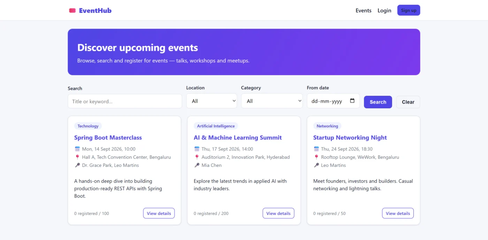
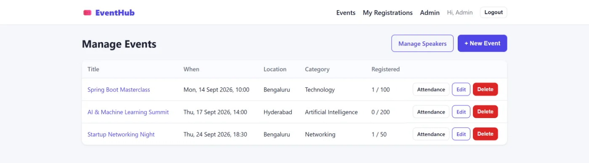
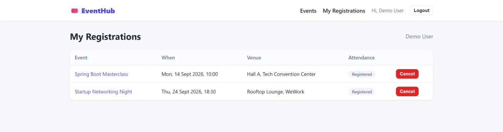

# EventHub — Event Management Platform

Browse, search and register for events; administrators manage events, speakers and
attendance. Registrations are protected against double-booking at the database level,
and a scheduled job sends reminder emails. **Spring Boot 3.2.5** on **Java 17** with a
**React (Vite)** frontend.

[**Live demo**](https://event-management-system-1qiv.vercel.app/) &nbsp;·&nbsp; Backend on Render, frontend on Vercel



---

## Contents

- [Tech stack](#tech-stack)
- [Architecture](#architecture)
- [Data model](#data-model)
- [API reference](#api-reference)
- [Getting started](#getting-started)
- [Configuration](#configuration)
- [Testing](#testing)
- [Deployment](#deployment)
- [Screenshots](#screenshots)

---

## Tech stack

| Layer | Technology |
|---|---|
| Language | Java 17 |
| Framework | Spring Boot 3.2.5 |
| Security | Spring Security + JWT (`jjwt`), BCrypt |
| Persistence | Spring Data JPA / Hibernate |
| Database | PostgreSQL (default) · MySQL driver bundled · H2 for tests |
| Mail | `spring-boot-starter-mail` + `@Scheduled` reminders |
| Monitoring | Spring Boot Actuator |
| Build | Maven |
| Frontend | React (Vite), Axios |
| Testing | JUnit 5, Mockito, Spring Security Test, H2 |
| Container | Docker (multi-stage) |

---

## Architecture

Layered, with every service split into an **interface plus an `Impl`** so controllers
depend on abstractions and tests can substitute mocks without a Spring context.

```
React SPA ──> JwtAuthenticationFilter ──> Controller ──> Service ──> Repository ──> PostgreSQL
  (Axios)      (Spring Security)          (5 classes)   (iface +    (Spring Data JPA)
                                                          Impl)
                                                            │
                                        EventReminderScheduler └──> SMTP (reminder emails)
                                             (@Scheduled)
```

**Package layout** (`com.eventhub.ems`)

| Package | Responsibility |
|---|---|
| `security` | `JwtService`, `JwtAuthenticationFilter`, `SecurityConfig`, `CustomUserDetailsService` |
| `controller` | Auth, Event, Registration, Speaker, Admin + `GlobalExceptionHandler` |
| `service` | Interfaces and `Impl` classes; `EmailService`, `EventReminderScheduler` |
| `repository` | Spring Data JPA interfaces |
| `model` | JPA entities and the `Role` enum |
| `dto` | Request/response payloads plus `DtoMapper` |
| `exception` | `ResourceNotFoundException`, `ConflictException` |

**Design decisions worth noting**

- **Double-booking is impossible, not merely unlikely.** `registrations` carries a
  composite `@UniqueConstraint(columnNames = {"user_id", "event_id"})`. Two concurrent
  requests for the last seat cannot both succeed, because the database rejects the
  second insert — an application-level "check then insert" would leave a race window.
- **Interface + implementation.** `EventService`/`EventServiceImpl`,
  `RegistrationService`/`RegistrationServiceImpl`, and so on. Slightly more files, but
  controller tests mock an interface rather than a concrete class.
- **Lazy many-to-many.** `Event ↔ Speaker` is joined through `event_speakers` with
  `FetchType.LAZY`, so listing events doesn't drag in every speaker graph.
- **Enums stored as strings.** `@Enumerated(EnumType.STRING)` — reordering the `Role`
  enum later can't silently change what existing rows mean.
- **Mail is opt-in.** `app.mail.enabled` defaults to `false`, so a fresh clone runs
  without SMTP credentials. The reminder cron is configurable via `REMINDER_CRON`.

---

## Data model

Five model classes across six tables (including the join table).

```
users 1───N registrations N───1 events N───N speakers
                                   (via event_speakers)
```

| Relationship | Mapping | Notes |
|---|---|---|
| `User` → `Registration` | `@ManyToOne(LAZY, optional = false)` | One row per signup |
| `Event` → `Registration` | `@ManyToOne(LAZY, optional = false)` | Capacity checked in the service |
| `Registration` | `@UniqueConstraint(user_id, event_id)` | **DB-enforced** no-duplicate guard |
| `Event` ↔ `Speaker` | `@ManyToMany(LAZY)` + `@JoinTable(event_speakers)` | `Set<Speaker>`, so no duplicates |
| `User.role` | `@Enumerated(STRING)` | `USER` / `ADMIN` |

Schema is managed by `spring.jpa.hibernate.ddl-auto=update`.

---

## API reference

18 endpoints across 5 controllers.

### Auth — `/api/auth`

| Method | Path | Auth | Description |
|---|---|---|---|
| `POST` | `/register` | Public | Create an account |
| `POST` | `/login` | Public | Exchange credentials for a JWT |
| `GET` | `/me` | User | Current user |

### Events — `/api/events`

| Method | Path | Auth | Description |
|---|---|---|---|
| `GET` | `/` | Public | List events — filter by keyword, location, category, date |
| `GET` | `/{id}` | Public | Event detail |

### Registrations

| Method | Path | Auth | Description |
|---|---|---|---|
| `POST` | `/api/events/{eventId}/register` | User | Register for an event |
| `DELETE` | `/api/events/{eventId}/register` | User | Cancel a registration |
| `GET` | `/api/registrations/me` | User | My registrations |

### Speakers — `/api/speakers`

| Method | Path | Auth | Description |
|---|---|---|---|
| `GET` | `/` | Public | List speakers |
| `GET` | `/{id}` | Public | Speaker detail |

### Admin — `/api/admin`

| Method | Path | Auth | Description |
|---|---|---|---|
| `POST` | `/events` | **ADMIN** | Create an event |
| `PUT` | `/events/{id}` | **ADMIN** | Update an event |
| `DELETE` | `/events/{id}` | **ADMIN** | Delete an event |
| `POST` | `/speakers` | **ADMIN** | Create a speaker |
| `PUT` | `/speakers/{id}` | **ADMIN** | Update a speaker |
| `DELETE` | `/speakers/{id}` | **ADMIN** | Delete a speaker |
| `GET` | `/events/{id}/registrations` | **ADMIN** | Attendee list |
| `PUT` | `/registrations/{id}/attendance` | **ADMIN** | Mark attendance |

Health check: `GET /actuator/health`.

---

## Getting started

### Prerequisites

- JDK 17+
- Maven 3.8+
- PostgreSQL 14+ running locally
- Node.js 18+

### Backend

```bash
cd backend
mvn spring-boot:run
```

Starts on `http://localhost:8081`. Schema is created on first run and seed data is
loaded by `DataInitializer`.

### Frontend

```bash
cd frontend
cp .env.example .env
npm install
npm run dev
```

Runs on `http://localhost:5173`.

### With Docker

```bash
cd backend
docker build -t eventhub-api .
docker run -p 8081:8081 --env-file .env eventhub-api
```

---

## Configuration

| Variable | Default | Purpose |
|---|---|---|
| `DB_URL` | `jdbc:postgresql://localhost:5432/eventhubdb` | JDBC connection string |
| `DB_HOST` / `DB_PORT` / `DB_NAME` | `localhost` / `5432` / `eventhubdb` | Used if `DB_URL` isn't set |
| `DB_USERNAME` | `postgres` | Database user |
| `DB_PASSWORD` | *(empty)* | Database password |
| `DB_POOL_SIZE` | `5` | HikariCP maximum pool size |
| `JWT_SECRET` | dev default | **Change in production** — min 32 bytes |
| `JWT_EXPIRATION_MS` | `86400000` | Token lifetime (24h) |
| `CORS_ORIGINS` | `http://localhost:5173,http://localhost:3000` | Allowed origins |
| `MAIL_ENABLED` | `false` | Turn reminder emails on |
| `MAIL_HOST` / `MAIL_PORT` | `smtp.gmail.com` / `587` | SMTP server |
| `MAIL_USERNAME` / `MAIL_PASSWORD` | *(empty)* | SMTP credentials |
| `MAIL_FROM` | `no-reply@eventhub.local` | Sender address |
| `REMINDER_CRON` | `0 0 * * * *` | Reminder schedule — hourly |
| `SPRING_PROFILES_ACTIVE` | `local` | Active profile |
| `PORT` | `8081` | Server port |

---

## Testing

```bash
cd backend
mvn test
```

**72 tests across 12 classes**, running against an in-memory **H2** database so the
suite needs no PostgreSQL instance:

| Kind | Scope |
|---|---|
| Service unit tests | `EventServiceTest`, `RegistrationServiceTest`, `SpeakerServiceTest` — Mockito |
| Controller slices | Auth, Event, Registration and Admin controllers with Spring Security Test |
| Repository tests | `EventRepositoryTest`, `RegistrationRepositoryTest`, `UserRepositoryTest` |
| Context | `EventManagementApplicationTests` |

The registration repository test covers the unique-constraint path — the duplicate
insert must fail.

---

## Deployment

- **Backend** — Render, from the multi-stage `backend/Dockerfile`; `render.yaml`
  holds the blueprint for the monorepo layout.
- **Frontend** — Vercel, building from `frontend/`.

---

## Screenshots

**Admin — manage events**



**My registrations**



---

## Author

**Kshitij Raj** — Java Full Stack Developer
[Portfolio](https://kshitijraj0722.github.io/Kshitij-Portfolio/) ·
[LinkedIn](https://www.linkedin.com/in/kshitij-raj0722) ·
[GitHub](https://github.com/KshitijRaj0722)
